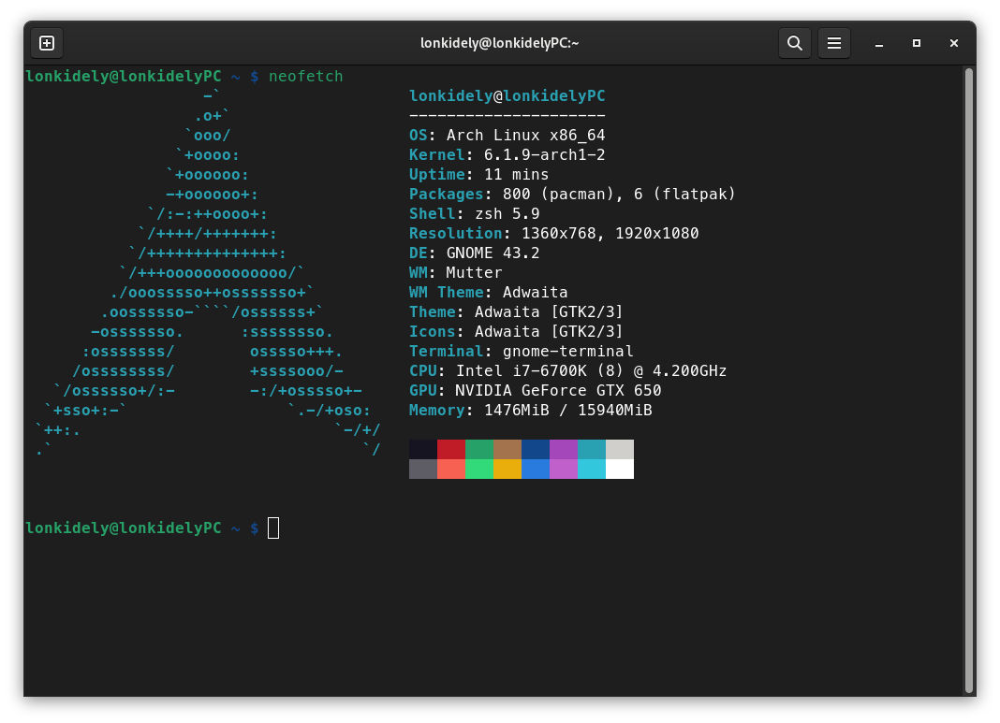
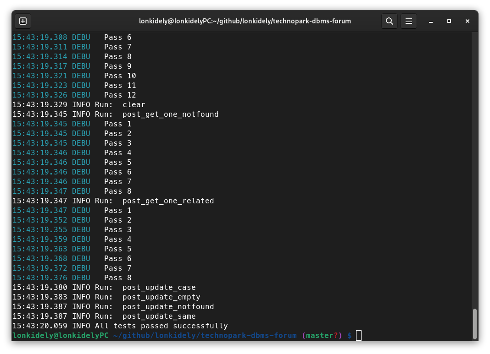
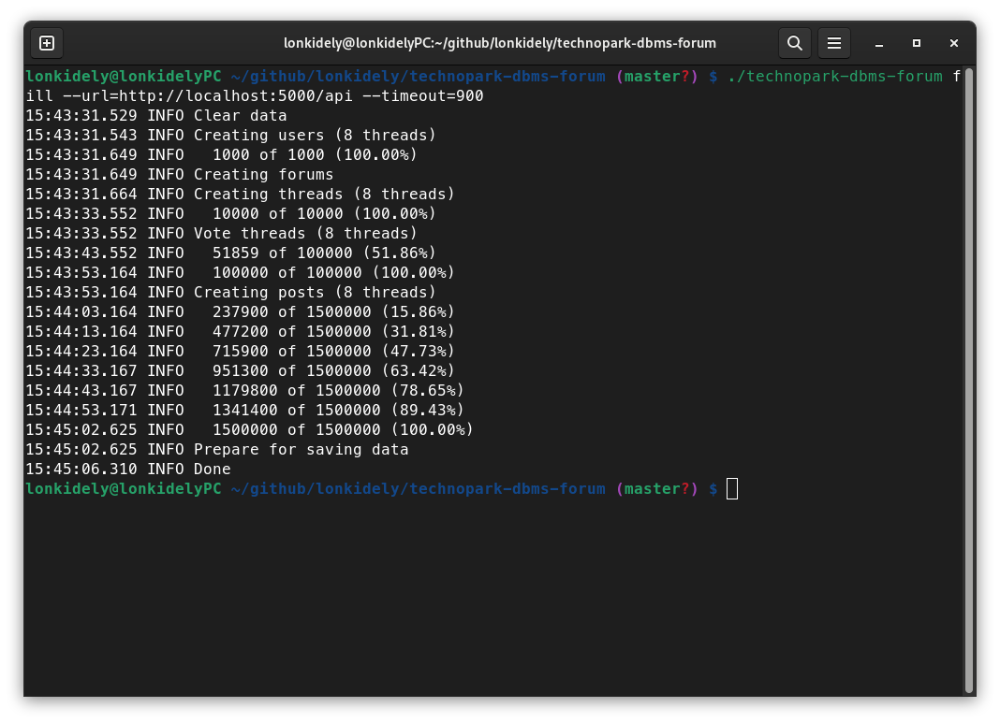
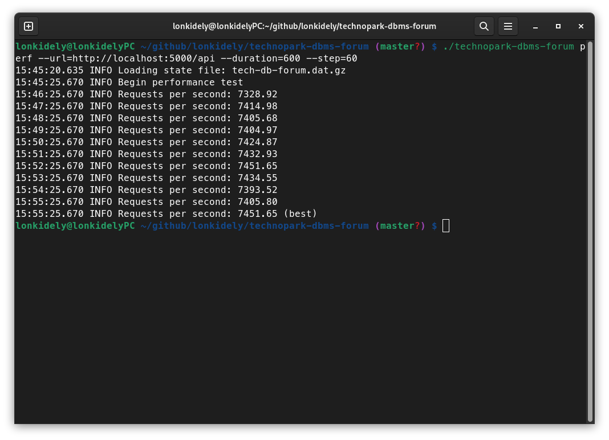

## tech-db-forum

Тестовое задание для реализации проекта "Форумы" на курсе по базам данных в Технопарке Mail.ru (https://park.vk.company).

Суть задания заключается в реализации API к базе данных проекта «Форумы» по документации к этому API.

Таким образом, на входе:

- документация к API в файле ./swagger.yaml;

На выходе:
- репозиторий, содержащий все необходимое для разворачивания сервиса в Docker-контейнере.

### [Swagger](https://github.com/mailcourses/technopark-dbms-forum/blob/master/swagger.yml)

### Тестирование на локальной машине

#### Сборка тестирующей программы
```
go get -u -v github.com/mailcourses/technopark-dbms-forum@master
go build github.com/mailcourses/technopark-dbms-forum
```

#### Сборка докер-контейнера
```
git clone --single-branch https://github.com/lonkidely/technopark-dbms-forum
docker build --no-cache -t park technopark-dbms-forum
```

#### Запуск контейнера
```
docker run -d --memory 2G --log-opt max-size=5M --log-opt max-file=3 --name park_perf -p 5000:5000 park
```

#### Тестирование
```
// Функциональное тестирование
./technopark-dbms-forum func -u http://localhost:5000/api -r report.html

// Наполнение базы
./technopark-dbms-forum fill --url=http://localhost:5000/api --timeout=900

// Нагрузочное тестирование
./technopark-dbms-forum perf --url=http://localhost:5000/api --duration=600 --step=60
```

### Результаты тестирования

#### Тестовый стенд

#### Функциональное тестирование

#### Наполнение базы

#### Нагрузочное тестирование


#### Таким образом, при локальном тестировании получен результат 7451 RPS.
